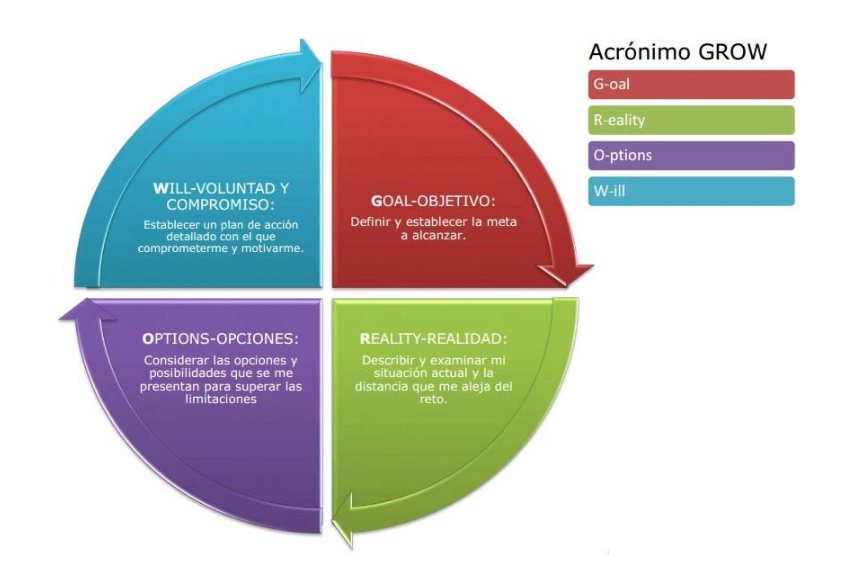

# Cómo establecer los Objetivos de Trabajo

- Un objetivo es aquello que se quiere conseguir, la meta a alcanzar, el
propósito.
- En todos los procesos de desarrollo es imprescindible establecer un
objetivo, que debe tener unas características bien definidas para
conseguir cambio y transformación.
- La idea es no seguir siendo la misma que empezó el proceso.

## Objetivos SMART

- **S de Specific (específico)** - Concretar, huir de objetivos difusos
- **M de Measurable (medible)** – lo que no se puede medir no se puede
mejorar
- **A de Attainable (alcanzable, conseguible)** – retador pero factible y
de consecución propia
- **R de Resonant (resonante)** – que, de cierto vértigo, ni demasiado
fácil ni “imposible” Importante para nosotros, de 1 a 10, cómo de
importante, mínimo 10, qué merezca la pena el esfuerzo
- **T de Time-bound (ligado al tiempo)** – acotado en el tiempo, cuándo
quiero conseguirlo

## ¿Qué hago con mi objetivo? El Modelo GROW (Sir John Whitmore)

## Plan de Acción

- Objetivos bien definidos a corto/medio y largo plazo.
- ¿Qué voy a hacer para alcanzar los objetivos?
- El plan de acción es la parte fundamental y la herramienta básica con
la que trabajan el Mentor-a y la Mentee.
- Las acciones han de ser simples y en continua revisión.
- Al igual que el objetivo, el Plan de Acción, es algo vivo, que
evoluciona junto con la persona y el Proceso de Mentoring.

## Plantilla de registro de los componentes del Plan de Acción

| Objetivo  ¿Qué quieres conseguir? | Acciones  ¿Qué vas a hacer para conseguirlo? | Evidencias de resultado  ¿Cómo sabrás que los has conseguido?      |  Temporización  ¿Cuándo estará hecho? |
|----------|:-------------:|------:|------:|
|  |   |  |   |
